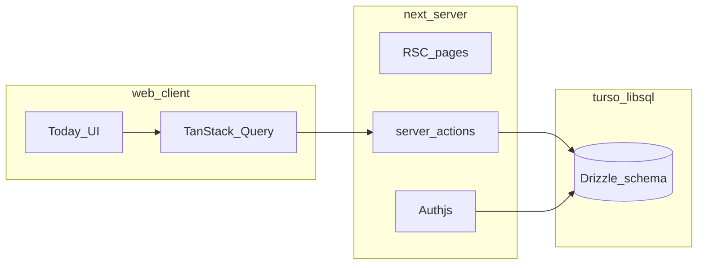

# Time Keeper — v0.1 phase plan and design schema (authoritative doc)

This document defines **phase scope = v0.1** per [spec_v4.md](../spec_v4.md) §9 and records **what shipped in `web/`**, **manual verification**, and **what is left** (mostly CI wiring on your GitHub remote).

---

## 1. Purpose and how to use this doc

- **Product spec:** [spec_v4.md](../spec_v4.md) — §5–6 (data + behaviors), §9 phasing.
- **Infra:** [tech_setup_v2.md](../tech_setup_v2.md).
- **Design governance:** [design.md](./design.md) and [Time-keeper/](../Time-keeper/) prototypes.

---

## 2. Phase definition (v0.1)

**Goal:** “Start using it” — auth, categories, time blocks, Today, basic credits, PWA shell, mobile-first UI.

**Still out of scope:** tasks, End Day, habits, full bottom nav, week/month **history** views — see §9 v0.2+ in the product spec.

---

## 3. What shipped in the repo (`web/`)

| Area | Status | Where / notes |
|------|--------|----------------|
| Auth (Resend magic link) | Shipped | `src/auth.ts`, `src/app/api/auth/[...nextauth]/`, `/login` |
| Drizzle + Turso schema | Shipped | `src/db/schema.ts`, `drizzle/0000_init.sql` — run `npm run db:migrate` |
| Categories seed + CRUD | Shipped | Defaults on first session; `/categories` |
| Time blocks start/stop | Shipped | `/today` — one running block (partial unique index) |
| Manual backfill, edit, delete | Shipped | `/today` |
| Credits (per block only) | Shipped | Spec §6.2 formula; free-time spends; all-time balance on Today |
| Today view | Shipped | Running clock, today’s list, long-session banner |
| PWA | Shipped | `public/manifest.json`, `public/sw.js`, `/icon`, `ServiceWorkerRegister` |
| Design tokens (Variation A + kitchen sink palette) | Shipped | `globals.css`, `src/styles/design-tokens.ts`, [design.md](./design.md) |
| Hydration-safe clock / date headline | Shipped | Server `calendarHeadline` + `runningElapsedSeconds`; `LiveElapsed` |
| Toasts | Shipped | Sonner **bottom-center** + offset (clears top nav) |
| Optional **focus session countdown** | Shipped (v0.1 add-on) | Presets 25 / 45 / 60 / 90 min or **custom minutes** (1–720) before **Start**; while active, the running card shows **only** the goal countdown (no elapsed count-up); stored in **`localStorage`** keyed by block id (not persisted in DB). Cleared on stop. Full silent Pomodoro + SW persistence is **v0.3** per spec §6.14. |
| GitHub Actions workflow file | In repo | [.github/workflows/ci.yml](../.github/workflows/ci.yml) — **not yet confirmed** on your remote until you push and enable Actions |

---

## 4. Residual / follow-up (not blocking “usable app”)

1. **CI on GitHub:** Push `main`, confirm Actions runs `typecheck` + `lint` + `build` under `web/`. Fix branch protection if you use it.
2. **Vercel:** Root directory `web/`; env vars including `AUTH_URL` = production URL.
3. **History / stats UI:** Week + month + all-time analysis are **spec’d in v0.2–v0.4** (see spec §6.16, §9). v0.1 only shows **today-overlapping** blocks + balance — not a full history browser.

---

## 5. Design schema governance

Unchanged: see [design.md](./design.md). New UI (focus presets, bottom toasts) follows existing tokens.

---

## 6. Architecture snapshot (v0.1)

---

## 7. Verification log (manual)

**Owner-tested (2026):** sign-in (1), categories (2–6), time tracking (4), credits (5), Today (5), PWA sanity (6).

| Criterion | Result |
|-----------|--------|
| Magic link | Pass |
| Default categories + CRUD | Pass |
| Start / stop / manual / edit / delete | Pass |
| Credits + free time | Pass |
| CI green on GitHub | **Pending** (workflow present; remote not verified) |
| Mobile 375px | Spot-check as needed |
| Design vs artboards | Subjective; tokens documented |

---

## 8. Risks and decisions

- Focus countdown is **client-only** until you add a DB column (e.g. `session_target_minutes` on `time_blocks`) if you want multi-device sync or audit trail.
- Monorepo: Vercel **Root Directory** = `web/`.
